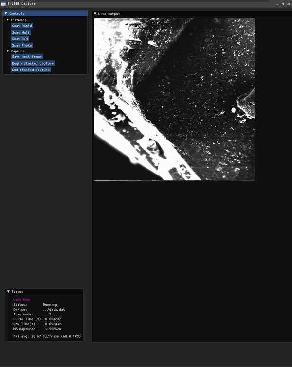
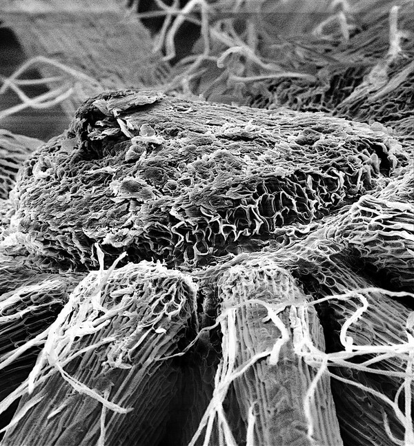

# Digital Image Control Program for the Hitachi S-2500 SEM

An OpenGL and Dear Imgui based control program for the [S-2500 STM32F7 digital image acquisition system](https://github.com/InconsolableCellist/s2500-image-capture-stm32f7)

